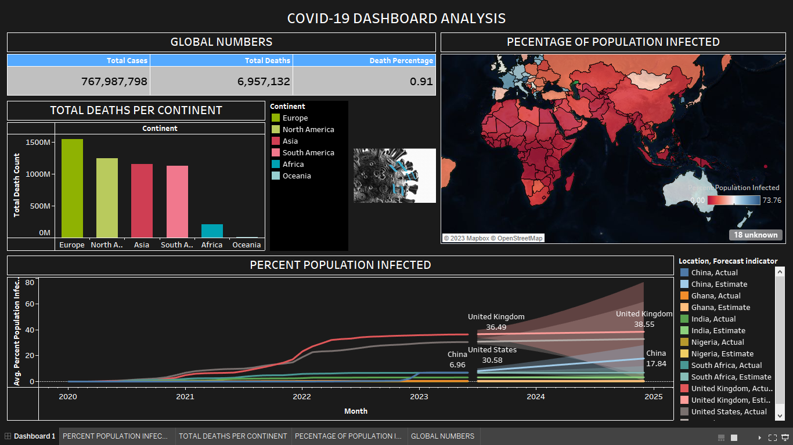

# COVID-19 Data Analysis with MySQL and Tableau

This repository contains MySQL codes and queries for analyzing COVID-19 data. Use these queries to gain valuable insights from COVID-19 datasets.

## Installation:
1. Install MySQL and set up the database.
2. Load the COVID-19 dataset into the database.
3. Create necessary tables and indexes.

## Data Sources:
1. The COVID-19 dataset used is from [Our World in Data].
2. Link to the dataset: [[dataset_link](https://ourworldindata.org/covid-deaths)]

## Usage:
1. Explore daily cases, cumulative cases, deaths, and recoveries.
2. Filter data by country, region, or date range.
3. Calculate mortality rates, growth rates, and hotspot identification.

## Codes:
* CREATE DATABASE Covid19;
* USE Covid19;

* SELECT * FROM CovidDeath;
* SELECT COUNT(*) FROM CovidDeath;

* SELECT * FROM CovidVaccination;
* SELECT COUNT(*) FROM CovidVaccination;

* -- HERE I WANT TO VIEW THE NUMBER OF POPULATION IN NIGERIA
* SELECT DISTINCT(population), location FROM CovidDeath WHERE location = 'Nigeria';

* -- HERE I WANT TO SEE HOW MANY RECORDS NIGERIA HAS
* SELECT  count(*) FROM CovidDeath WHERE location = 'Nigeria';

* -- HERE I WANT TO SEE ALL THE RECORDS IN NIGERIA IN CovidDeath TABLE
* SELECT * FROM CovidDeath WHERE location = 'Nigeria';

* -- HERE I WANT TO SEE ALL THE COUNTRIES WITH THEIR POPULATION COUNT
* SELECT  distinct(population), location FROM CovidDeath
WHERE continent IS NOT NULL;

* -- INITIALIZING SAFE MODE FOR UPDATES
* SET SQL_SAFE_UPDATES=0;  

* -- SET EMPTY SPACES AS NULL
* UPDATE CovidDeath
SET continent = NULLIF(continent, '')
WHERE continent = '';

* -- DELETING WITHOUT ALTERING THE COLUMN NAMES
* DELETE FROM CovidVaccination;
* DELETE FROM CovidDeath;

* -- CREATING ANOTHER 'DATE' COLUMN WITH THE RIGHT DATE DATATYPE FOR CovidDeath
* ALTER TABLE CovidDeath ADD new_date DATE AFTER date;
* UPDATE CovidDeath 
SET new_date = STR_TO_DATE(date, '%m/%d/%Y');

* -- CREATING ANOTHER 'DATE' COLUMN WITH THE RIGHT DATE DATATYPE FOR CovidVaccination
* ALTER TABLE CovidVaccination ADD new_date DATE after date;
* UPDATE CovidVaccination 
SET new_date = STR_TO_DATE(date, '%m/%d/%Y');

* -- CREATING ANOTHER 'new_vaccinations' COLUMN WITH THE RIGHT DATATYPE FOR CovidVaccination
* ALTER TABLE CovidVaccination ADD new_new_vaccinations DOUBLE after new_vaccinations;
* UPDATE CovidVaccination 
SET new_new_vaccinations  = CONVERT(new_vaccinations, DOUBLE);

* SELECT * FROM CovidDeath;
* SELECT * FROM CovidVaccination;

* SET SQL_SAFE_UPDATES=1;

* -- BEGINNING OF THE MAIN OBJECTIVES

* -- NUMBER 1
* -- LOOKIG AT TOTAL CASES vs TOTAL DEATHS
* -- SHOWING THE %LIKELIHOOD OF DYING IF YOU CONTACT COVID IN NIGERIA
* SELECT location, date, total_cases, total_deaths, (total_deaths/total_cases)*100 as DeathPercentage
FROM CovidDeath
WHERE location = 'Nigeria'
AND continent IS NOT NULL;

* --NUMBER 2
* -- LOOKIG AT TOTAL CASES vs POPULATION
* -- SHOW WHAT PERCENTAGE OF NIGERIAN POPULATION GOT COVID
* SELECT location, date, population ,total_cases, (total_cases/population)*100 as PercentPopulationInfected
FROM CovidDeath
WHERE location = 'Nigeria';

* -- NUMBER 3
* -- NIGERIA'S HIGHEST INFECTION RATE COMPARED TO POPULATION
* SELECT location, population, MAX(CAST(total_cases AS DOUBLE)) AS MAX_TOTAL_CASES  
FROM CovidDeath 
WHERE location = 'Nigeria' 
GROUP BY location, population;

* -- NUMBER 4
* -- COUNTRIES HIGHEST INFECTION RATE COMPARED TO POPULATION
* SELECT location, population , max(CAST(total_cases AS DOUBLE)) AS MAX_TOTAL
FROM CovidDeath
WHERE continent IS NOT NULL 
GROUP BY location, population
ORDER BY MAX_TOTAL DESC;

* --NUMBER 5 
* -- LOOKING AT COUNTRIES HIGHEST INFECTION RATE COMPARED TO POPULATION 
* -- WITH THEIR PECENTAGE %
* SELECT location, population, MAX(CAST(total_cases AS DOUBLE)) AS HighestInfectionCount, 
MAX((total_cases) / population)*100 as PercentPopulationInfected
FROM CovidDeath
-- WHERE continent IS NOT NULL
GROUP BY location, population
ORDER BY PercentPopulationInfected DESC;
* -- AS OF 12/7/2023 WE HAVE CYPRUS WITH 73.755% AS THE MOST INFECTED 
* -- AND YEMEN WITH 0.035% AS THE LOWEST INFECTED

* -- LOOKING AT COUNTRIES HIGHEST INFECTION RATE COMPARED TO POPULATION 
* -- WITH THEIR PECENTAGE DATE AND %
* SELECT location, population, date, MAX(CAST(total_cases AS DOUBLE)) AS HighestInfectionCount, 
MAX((total_cases) / population)*100 as PercentPopulationInfected
FROM CovidDeath
-- WHERE continent IS NOT NULL
GROUP BY location, population, date
ORDER BY PercentPopulationInfected DESC; 

* -- NUMBER 6
* -- NIGERIA'S HIGHEST DEATH COUNT COMPARED TO POPULATION
* SELECT location, Population, MAX(CAST(total_deaths AS DOUBLE)) AS MAX_TOTAL_DEATH 
FROM coviddeath 
WHERE location = 'Nigeria'
GROUP BY location, Population;

* -- NUMBER 7
* -- SHOWING COUNTRIES HIGHEST DEATH COUNT PER POPLATION
SELECT location, Population, MAX(CAST(total_deaths AS DOUBLE)) AS MAX_TOTAL_DEATH
FROM CovidDeath
WHERE continent IS NOT NULL
GROUP BY location, Population
ORDER BY MAX_TOTAL_DEATH DESC;

* SELECT * FROM CovidDeath;

* -- NUMBER 8
* -- LET'S BREAK THINGS DOWN BY CONTINENT
* -- SHOWING THE CONTINENT WITH THE HIGHETS DEATH COUNT
* SELECT continent, MAX(CAST(total_deaths AS DOUBLE)) AS MAX_TOTAL_DEATH
FROM CovidDeath
WHERE continent IS NOT NULL
GROUP BY continent
ORDER BY MAX_TOTAL_DEATH DESC;

* -- MAIN OF ^^^
* SELECT location, MAX(CAST(total_deaths AS DOUBLE)) AS MAX_TOTAL_DEATH
FROM CovidDeath
WHERE continent IS NULL
GROUP BY location
ORDER BY MAX_TOTAL_DEATH DESC;

* -- SHOWING THE CONTINENT WITH THE HIGHETS DEATH COUNT
* -- MAIN OF ^^^
* SELECT location, SUM(CAST(total_deaths AS DOUBLE)) AS TOTAL_DEATH_COUNT
FROM CovidDeath
WHERE continent IS NULL
AND location NOT IN ('World', 'High income', 'Upper middle income', 'Lower middle income', 'European Union', 'Low income')
GROUP BY location
ORDER BY TOTAL_DEATH_COUNT DESC;

* -- NUMBER 9
* -- OVERALL DEATH PERCENTAGE  
* SELECT SUM(new_cases) AS TOTAL_CASES, SUM(CAST(new_deaths AS DOUBLE)) AS TOTAL_DEATHS, SUM(CAST(new_deaths AS DOUBLE))/SUM(new_cases)*100 AS DeathPercentage
FROM CovidDeath
WHERE continent IS NOT NULL;

* EXPLAIN SELECT * FROM CovidVaccination;
* SELECT COUNT(*) FROM CovidVaccination;

* -- NUMBER 10
* -- LOOKING AT TOTAL POPULATION VS VACCINATION
* SELECT dea.continent, dea.location, dea.date, dea.population, vac.new_vaccinations AS vaccinations
FROM CovidDeath AS dea
JOIN CovidVaccination AS vac
ON dea.location = vac.location
AND dea.date =vac.date
WHERE dea.continent IS NOT NULL;

* -- NUMBER 11
* -- LOOKING AT NIGERIA'S POPULATION VS VACCINATION
* SELECT dea.continent, dea.location, dea.date, dea.population, vac.new_vaccinations
FROM CovidDeath AS dea
JOIN CovidVaccination AS vac
ON dea.location = vac.location
AND dea.date =vac.date
WHERE dea.continent IS NOT NULL AND dea.location = 'Nigeria';

* -- NUMBER 12
* -- LOOKING AT TOTAL POPULATION VS VACCINATION, ROLLINGPEOPLEVACCINATED
* SELECT dea.continent, dea.location, dea.date, dea.population, vac.new_vaccinations,
SUM(CONVERT(vac.new_vaccinations, DOUBLE)) OVER (PARTITION BY dea.location ORDER BY dea.location) RollingPeopleVaccinated
FROM CovidDeath AS dea
JOIN CovidVaccination AS vac
ON dea.location = vac.location
AND dea.date =vac.date
WHERE dea.continent IS NOT NULL;

* -- USING 'CTE' TO CREATE A TABLE
* WITH PopvsVac(Continent, location, date, population, new_vaccinations, RollingPeopleVaccinated)
AS(
* SELECT dea.continent, dea.location, dea.date, dea.population, vac.new_vaccinations,
SUM(CONVERT(vac.new_vaccinations, DOUBLE)) OVER (PARTITION BY dea.location ORDER BY dea.location, dea.date) RollingPeopleVaccinated
FROM CovidDeath AS dea
JOIN CovidVaccination AS vac
ON dea.location = vac.location
AND dea.date =vac.date
WHERE dea.continent IS NOT NULL)
* SELECT *, ( RollingPeopleVaccinated/population)*100 AS ROLL_POPULATION
FROM PopvsVac;

* -- USING 'TEMP TABLE' TO CREATE A TABLE
* DROP TABLE IF EXISTS pop_vac;
* CREATE TABLE pop_vac(
Continent VARCHAR(100),
Location VARCHAR(100),
new_date DATE,
Population DOUBLE,
new_new_vaccinations DOUBLE,
RollingPeopleVaccinated DOUBLE);
* INSERT INTO pop_vac
* SELECT dea.continent, dea.location, dea.new_date, dea.population, vac.new_new_vaccinations,
SUM(CONVERT(vac.new_vaccinations, DOUBLE)) OVER (PARTITION BY dea.location ORDER BY dea.location, dea.new_date) RollingPeopleVaccinated
FROM CovidDeath AS dea
JOIN CovidVaccination AS vac
ON dea.location = vac.location
AND dea.new_date =vac.new_date
WHERE dea.continent IS NOT NULL;
* SELECT *, ( RollingPeopleVaccinated/population)*100 AS ROLL_POPULATION
FROM pop_vac;

## Contact:
*For questions or collaboration, reach out to nwisijames@gmail.com
